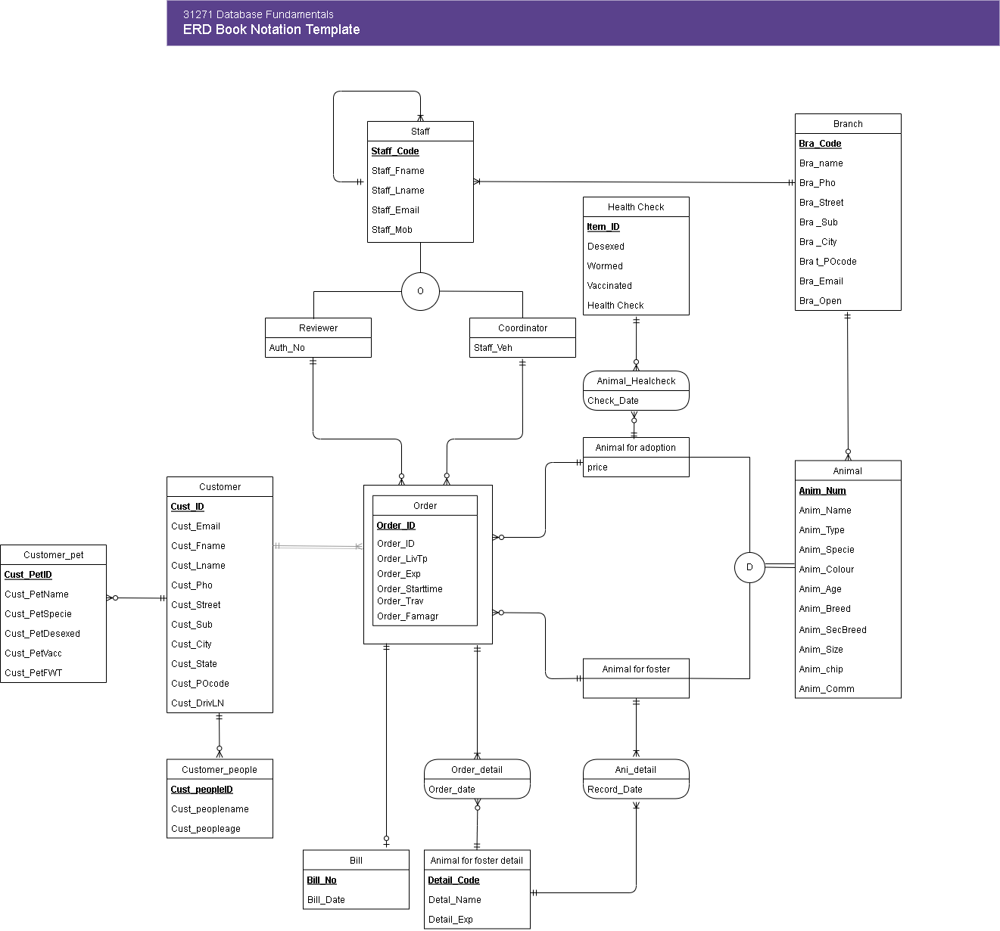

# 🐾 Animal Shelter Database System (PostgreSQL)

This project presents a **complete relational database system** designed from scratch for a **real-world animal shelter**. It models and supports the operations of fostering and adopting animals in a multi-branch organisation.

> ✅ All modelling, implementation, SQL scripting, and testing were independently completed by the developer, based on realistic functional requirements and use cases.

---

## 📌 Problem Statement

Animal shelters need robust information systems to track animal intake, adoptions, medical status, and customer interactions. The goal was to design a scalable and normalised relational database that:

- Supports **adoption and foster programs** with detailed order management.
- Manages **staff roles**, including reviewers and coordinators.
- Tracks **animals, health records, branches**, and **customer orders**.
- Allows efficient **data queries** for reporting, operations, and strategic planning.

---

## 🧠 Analysis & Design Approach

### 🔹 Step 1: Real-world Mapping to Entities

Based on industry examples (e.g. [AWL NSW](https://www.awlnsw.com.au/)), I identified and defined all major entities and relationships, such as:

- `Customer`, `Animal`, `Staff`, `Order_T`, `Order_detail`
- `Coordinator`, `Reviewer`, `Animal_for_foster_detail`, etc.

### 🔹 Step 2: ERD Construction

A complete **Entity-Relationship Diagram (ERD)** was created to represent relationships and cardinalities among entities.

### 🔹 Step 3: Logical Design & Normalisation

All tables were designed to meet **3rd Normal Form (3NF)** to reduce redundancy and maintain referential integrity.

---

## 🛠️ Implementation

### ✅ Database Platform

- PostgreSQL

### ✅ Key Deliverables

- `DBanimalservice.sql` – Contains full DDL and DML SQL scripts for:
  - Table creation with constraints and foreign keys
  - Sample data insertion for testing
  - Practical `SELECT`, `JOIN`, and `GROUP BY` queries for reporting

- `AnimalShelter_ERD.png` – Visual entity-relationship diagram
- `AnimalShelter-database-report.pdf` – Full report documenting design decisions, justifications, and SQL logic

---

